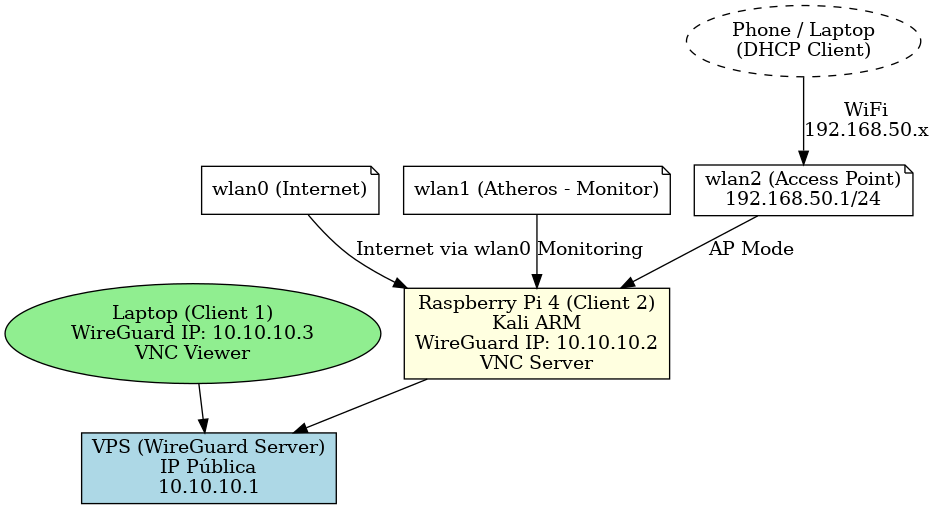
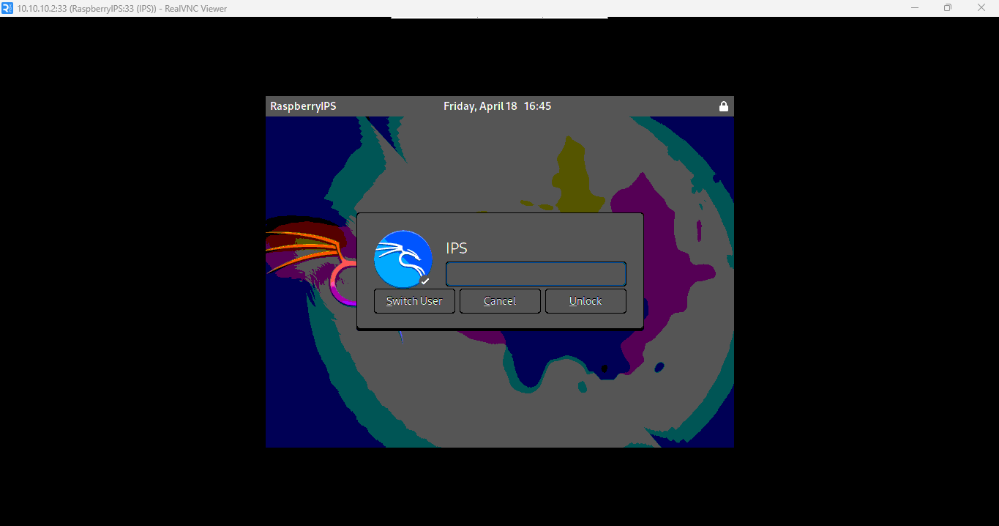

# 🛰️ Project: VPN Gateway with WireGuard + Raspberry Pi 4 (8GB RAM)

This repository contains the documentation and files needed to set up a VPN network with WireGuard, using a VPS and a Raspberry Pi 4 as a WiFi gateway and portable environment for offensive and defensive cybersecurity.

👉 This project is also presented at: [framcoty322.github.io](https://framcoty322.github.io)

---

## 🔧 Requirements

- A VPS with public IP (Debian/Ubuntu recommended)
- Raspberry Pi 4 Model B (8GB RAM, running Kali Linux ARM)
- WireGuard installed on both devices
- At least 2 WiFi adapters on the RPi (one can be internal)

---

## 🧠 Project Overview

- WireGuard VPN server hosted on a VPS
- Two clients connected: Laptop and Raspberry Pi
- VNC Viewer used for remote GUI access to the RPi
- Raspberry Pi has 4 network interfaces:
  - `wg0`: WireGuard VPN
  - `wlan0`: Internet access for the RPi
  - `wlan1`: TP-Link Atheros for wireless attacks
  - `wlan2`: Access Point (simulated router) routed through VPN

---
## 🗺️ Network Topology Diagram

This diagram illustrates the full connectivity between your devices through the WireGuard VPN and how the Raspberry Pi operates as a portable WiFi gateway.



## 🚀 Steps to Deploy

### ✅ Step 1: WireGuard Server Setup on VPS

Set up the WireGuard server on your VPS.  
Use the configuration example in:  
📄 [`wireguard/configs/server.conf`](./wireguard/configs/server.conf)

```bash
sudo apt update && sudo apt install wireguard
sudo nano /etc/wireguard/wg0.conf
# Paste your server.conf content and enable with:
sudo wg-quick up wg0
sudo systemctl enable wg-quick@wg0
```

### ✅ Step 2: Configure Raspberry Pi WireGuard Client

Create a client configuration for the RPi  
📄 ['wireguard/configs/client-rpi.conf'](./wireguard/configs/client-rpi.conf)
Ensure you usse the correct private key and the server's public key
Start the VPN tunnel:
```bash
sudo wg-quick up wg0

```

###✅ Step 3: Configure Laptop WireGuard Client
Also connect your laptop to the VPN
📄 [`wireguard/configs/client-laptop.conf`](./wireguard/configs/client-laptop.conf)
Test that both clients(RPi and Laptop) can ping each other through their VPN IPs.

###✅ Step 4:Install & Configure VNC Server on Raspberry Pi
To allow remote graphical access to the Raspberry Pi over the VPN:

```bash

scripts/vnc-server-setup.sh
```
	this script:
	Installs tightvncserver and fonts
	Creates ~/.vnc/xstartup/ to launch the default kali Linux desktop
	Starts the server on port :33 with resolution 800x600
###✅ Step 5: Connect via VNC Viewer from Laptop
Once the VPN is up and VNC is running on the Raspberry Pi:
	1. Open VNC Viewer on your laptop
	2. Enter the VPN IP + port:
		10.10.10.2:5933
	3. Login with the password set during the first VNC launch
✅ Now you have full graphical access to the Raspberry Pi over a secure VPN tunnel.
📸 Visual confirmation from RealVNC Viewer:

**🔐 Login screen:**


**🖥️ Full Kali desktop from Raspberry Pi:**


### ✅ Step 6: Set up Access Point (wlan2 ➜ wg0)

Once inside the Raspberry Pi (via SSH or VNC), configure `wlan2` to act as a WiFi router, routing all traffic through the VPN tunnel (`wg0`).

Run the following script:

```bash
scripts/start-ap-vpn.sh
```
### 🧼 Step 6.1: Stop Router Mode on wlan2

If you need to stop the Access Point and clean up the network routing, run:

```bash
scripts/stop-ap-vpn.sh
```
### ✅ Step 7: Configure hostapd and dnsmasq for Access Point

📁 Files located in [`wifi/`](./wifi):

- `hostapd.conf`: defines SSID, encryption, channel, etc.
- `dnsmasq.conf`: provides DHCP for devices on wlan2

These files are required for your Raspberry Pi to broadcast a WiFi network and assign IPs to connected clients.

Update the system configs:

```bash
sudo cp wifi/hostapd.conf /etc/hostapd/hostapd.conf
sudo cp wifi/dnsmasq.conf /etc/dnsmasq.conf
sudo systemctl enable hostapd
sudo systemctl enable dnsmasq
```